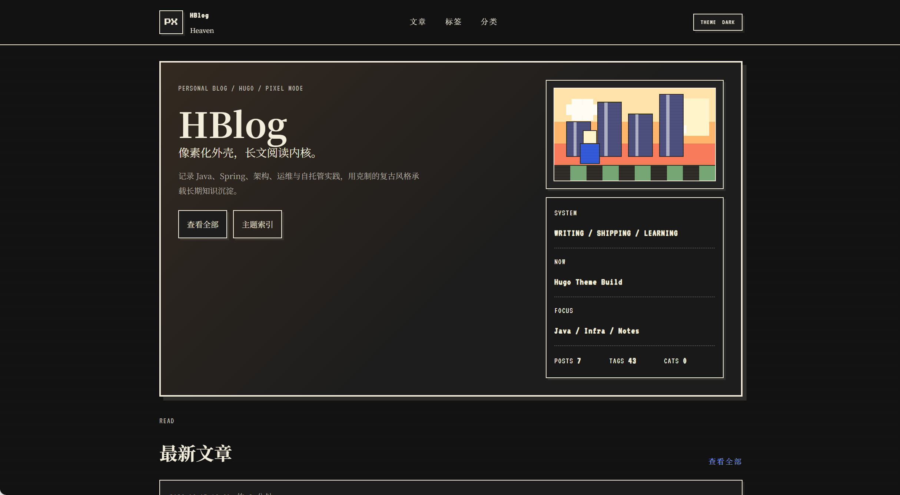
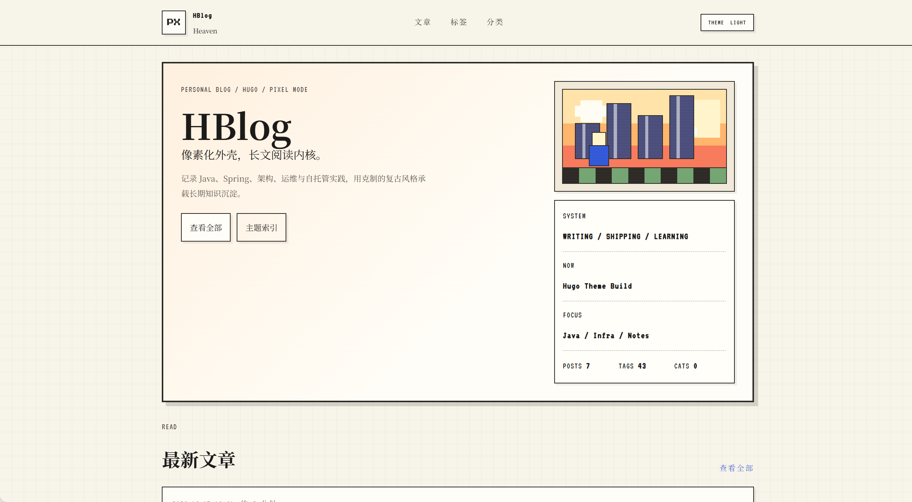

# Pixel Persona

> 像素人格：一款面向个人博客的像素风 Hugo 主题。

Pixel Persona 是一款为个人博客与技术写作者设计的 Hugo 主题。它不是纯游戏化界面，而是在像素边框、复古质感、长文阅读体验和内容优先的信息结构之间取得平衡，让博客既有辨识度，也适合长期写作与阅读。

## 预览

<p align="center">
  
  
</p>

<p align="center">
  <sub>暗色模式首页</sub>
  &nbsp;&nbsp;&nbsp;&nbsp;
  <sub>亮色模式首页</sub>
</p>

## 特性

- 像素风视觉语言：像素边框、复古终端气质、克制的深色配色
- 长文阅读优先：更宽的正文舞台、清晰的文章层级、适合技术文章浏览
- 首页内容导向：Hero、文章网格、归档时间轴
- 标签系统增强：标签云卡片、标签页时间轴布局
- 文章页增强：右侧目录、信息栏、AI 摘要区块
- 代码块增强：语言工具栏、复制按钮、自定义深色语法高亮配色
- 深色模式支持：亮暗主题切换
- 响应式布局：适配桌面端与移动端
- MIT 协议开源

## 适用场景

这个主题适合：

- 个人技术博客
- 开发者知识库
- 运维 / 架构 / 编程随笔
- 需要“有风格但不牺牲可读性”的内容站

如果你偏好极简文档风、复古像素风、深色代码块和内容优先的博客结构，Pixel Persona 会比较合适。

## 安装

### 方式一：Git Submodule

```bash
git submodule add git@github.com:heavenpls/hugo-theme-pixel-persona.git themes/pixel-persona
```

### 方式二：直接克隆

```bash
git clone git@github.com:heavenpls/hugo-theme-pixel-persona.git themes/pixel-persona
```

如果你更习惯 HTTPS，也可以使用：

```bash
git clone https://github.com/heavenpls/hugo-theme-pixel-persona.git themes/pixel-persona
```

## 启用主题

在 Hugo 配置中设置：

### `hugo.toml`

```toml
theme = "pixel-persona"
```

### `config/_default/hugo.yaml`

```yaml
theme: "pixel-persona"
```

## 最小配置示例

```toml
baseURL = "https://example.org/"
languageCode = "zh-cn"
title = "My Blog"
theme = "pixel-persona"

[params]
  description = "像素风个人博客"
  ShowReadingTime = true
  ShowRightToc = true

  [params.author]
    name = "heavenpls"
    bio = "Backend engineer, architecture tinkerer, and long-form note taker."

  [params.pixelTheme]
    showHero = true
    showStatusPanel = true
    heroLead = "像素化外壳，长文阅读内核。"
    heroDescription = "记录开发、架构、运维与长期写作。"
    statusLabel = "SYSTEM"
    statusValue = "WRITING / SHIPPING / LEARNING"
    nowLabel = "NOW"
    nowValue = "Building"
    focusLabel = "FOCUS"
    focusValue = "Java / Infra / Notes"

[menu]
  [[menu.main]]
    identifier = "posts"
    name = "文章"
    pageRef = "/posts"
    weight = 10

  [[menu.main]]
    identifier = "tags"
    name = "标签"
    pageRef = "/tags"
    weight = 20

  [[menu.main]]
    identifier = "categories"
    name = "分类"
    pageRef = "/categories"
    weight = 30

[markup]
  [markup.tableOfContents]
    startLevel = 1
    endLevel = 4

  [markup.highlight]
    noClasses = false
```

## 主题结构

```text
pixel-persona/
├── archetypes/
├── assets/
│   └── css/
├── i18n/
├── layouts/
│   ├── _default/
│   └── partials/
├── static/
│   └── js/
├── LICENSE
├── README.md
└── theme.toml
```

## 已实现的页面能力

- 首页：像素 Hero、状态面板、文章网格、归档时间轴
- 文章页：宽阅读列、右侧目录、摘要区、代码块复制按钮
- 标签总览页：标签云卡片
- 标签详情页：文章时间轴
- 分类 / terms / 404 页面

## 代码块体验

主题内置了针对技术博客的代码块增强能力：

- 顶部语言标识
- 可复制按钮
- 复制成功反馈
- 深色语法高亮
- 保持在正文列内部滚动，不破坏整体布局

## 推荐内容类型

Pixel Persona 特别适合这些文章内容：

- Java / Spring / Go / Python / Rust
- DevOps / Docker / Kubernetes / Linux
- 数据库 / 中间件 / 架构设计
- 工具链、工作流、部署文档
- 长篇技术说明、排障复盘、知识沉淀

## 开发建议

如果你准备在这个主题基础上继续开发，建议优先关注：

- `layouts/_default/`：页面结构
- `layouts/partials/`：可复用片段
- `assets/css/pixel-persona.css`：主题样式主入口
- `static/js/`：轻量交互脚本

## 作者信息

- GitHub: [heavenpls](https://github.com/heavenpls)
- Repository: [hugo-theme-pixel-persona](https://github.com/heavenpls/hugo-theme-pixel-persona)
- Contact Email: `1593623458@qq.com`

## License

本项目使用 [MIT License](./LICENSE) 开源。

## 开源说明

如果你当前维护的是完整博客站点仓库，建议把 `themes/pixel-persona` 单独抽出为独立仓库进行开源，这样可以避免把个人文章内容、站点级配置和非主题文件一起发布。

## 中文主题名建议

主题中文名建议使用：

`像素人格`

如果你希望在 GitHub、海报、掘金、博客园或主题市场介绍页里使用中文标题，这个名字和英文 `Pixel Persona` 的对应关系最自然。
